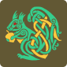

<p align="center">
  <picture>
    <source media="(prefers-color-scheme: dark)" srcset="assets/ratatoskr-logo-dark.svg">
    
  </picture>
  <br><br>
  <strong>Ratatoskr</strong><br>
  <em>A desktop email client built in Rust</em>
</p>

<p align="center">
  
  
  <a href="LICENSE"></a>
</p>

---

Multi-provider email client with calendar and contacts. Connects to Gmail, Microsoft Exchange, JMAP, and IMAP accounts from a single native UI built on [iced](https://iced.rs).

## Features

**Email**
- Four providers behind a unified interface — Gmail API, Microsoft Graph (Exchange/Outlook), JMAP, IMAP
- Smart threading (JWZ algorithm) with cross-account views
- Full-text search powered by [tantivy](https://github.com/quickwit-oss/tantivy)
- Smart folders with a query language (date ranges, labels, senders)
- Scheduled send, snooze, read receipts (MDN)
- HTML sanitization, tracking pixel detection, remote image blocking

**Compose**
- Rich text editor with formatting
- Attachment compression — images (mozjpeg, oxipng), PDFs (lopdf), Office documents
- Cloud attachments via OneDrive and Google Drive

**Calendar & Contacts**
- Google Calendar, CalDAV, JMAP calendar sync
- CardDAV contact management
- Contact import

**Privacy & Security**
- Local-first — all data stays on disk in SQLite + zstd-compressed content stores
- AES-256-GCM credential encryption
- AMP email stripping, URL tracking removal
- BIMI brand indicator verification

## Architecture

Cargo workspace with 23 crates. Key boundaries:

| Crate | Role |
|-------|------|
| `app` | iced UI — Elm architecture (boot/update/view) |
| `ratatoskr-core` | Facade over all subsystems: accounts, OAuth, actions, DB |
| `ratatoskr-sync` | Sync pipeline, JWZ threading, filters, categorization |
| `ratatoskr-stores` | Body store (zstd), inline images, attachment cache |
| `squeeze` | Attachment compression (CLI + library) |
| `gmail` / `jmap` / `graph` / `imap` | Provider implementations |
| `command-palette` | Fuzzy command search with context-sensitive keybindings |
| `smart-folder` | Query parser, date tokens, SQL builder |

## Building

```bash
# Check all crates
cargo check --workspace

# Run the app
cargo run -p app

# Check/test the squeeze compression tool
cargo check -p squeeze
cargo test -p squeeze
```

Requires Rust 1.92+ (edition 2024).

## License

Proprietary. All rights reserved.
